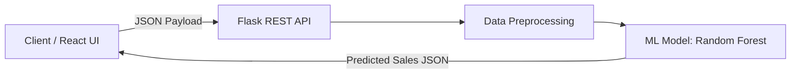

# 🛒 Big Mart Sales Prediction System


An end-to-end Machine Learning web application designed to predict the sales volume of products at Big Mart outlets. This project demonstrates the complete ML lifecycle—from Exploratory Data Analysis (EDA) and Feature Engineering to Model Deployment via a REST API and a modern frontend interface.

> **Note:** This project was developed as the Final Group Assignment for the Machine Learning Module.

---

## 🏗️ Architecture & Data Flow

The system follows a decoupled, full-stack micro-architecture:



## 🛠️ Tech Stack

- **Machine Learning:** Python, Pandas, Scikit-Learn, Joblib
- **Backend API:** Flask, Flask-CORS
- **Frontend:** React.js, Vite, HTML5/CSS3
- **Dataset:** [Big Mart Sales Prediction (Kaggle)](https://www.kaggle.com/datasets/shivan118/big-mart-sales-prediction-datasets)

---

## 📂 Repository Structure

```text
big-mart-sales-prediction/
├── data/           # Raw and processed datasets (Train.csv / Test.csv)
├── ml/             # Jupyter notebooks for EDA, Feature Engineering & Model Training
├── backend/        # Python/Flask REST API serving the ML model
├── frontend/       # React (Vite) application for the user interface
└── docs/           # Final project report and academic documentation

```

---

## 🚀 Getting Started (Local Development)

To run this project locally, you need to start both the Backend API and the Frontend Server.

### 1. Start the Backend API (Flask)

The backend loads the trained `.joblib` models and serves the `/predict` endpoint.

```bash
cd backend

# Create and activate a virtual environment
py -m venv venv
venv\Scripts\activate      # Windows (Use `source venv/bin/activate` for Mac/Linux)

# Install dependencies
pip install -r requirements.txt

# Run the server
py app.py

```

_The API will be running at: `http://127.0.0.1:5000_`

### 2. Start the Frontend Application (React)

Open a **new terminal tab/window**, and run the React app.

```bash
cd frontend

# Install Node modules
npm install

# Start the development server
npm run dev

```

_The frontend will provide a local URL (e.g., `http://localhost:5173`) to view the web app._

---

## 👥 Team & Contributions

This project was developed collaboratively, with each member managing a specific domain of the full-stack ML pipeline:

| Member      | Role                  | Key Responsibilities                                                                                               |
| ----------- | --------------------- | ------------------------------------------------------------------------------------------------------------------ |
| **Ahasna**  | Data & ML Engineer    | EDA, Data cleaning, Feature Engineering (Handling missing values, Encoding, Scaling), Model training & evaluation. |
| **KaveeN**  | Backend & GitHub Lead | GitHub repository management, Flask API development, Data preparation pipeline, ML model integration, API testing. |
| **Prasadi** | Frontend & Docs Lead  | React UI development, API consumption, state management, Final project report, and documentation.                  |

---

## ✅ Project Status (Completed)

- [x] Dataset explored and cleaned (EDA)
- [x] Feature engineering complete (Missing values, Encoding, Scaling, Outlier Treatment)
- [x] ML Models trained, evaluated, and compared (Random Forest selected)
- [x] Best model, scalers, and encoders exported as `.joblib`
- [x] Backend `/predict` endpoint successfully connected to the ML model
- [x] React frontend fully integrated with the Flask backend
- [x] Final academic report and documentation written
